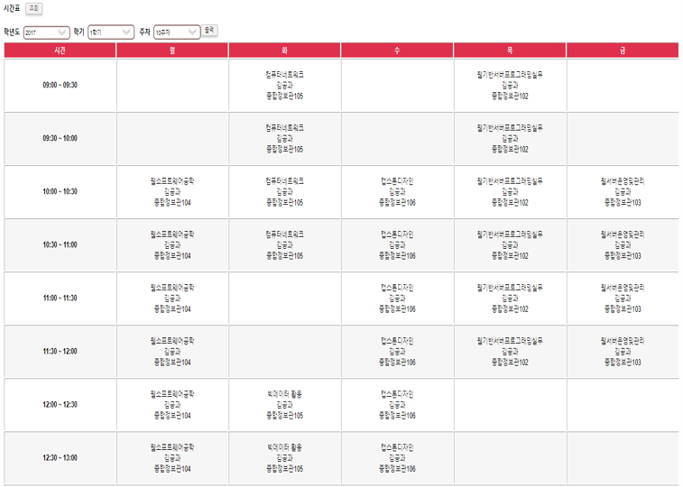

# Bachelor-Management-System
Bachelor Management System-JSP

main function

- Personal information system
- Graduates have a diagnostic system
- Course Registration System
- Lecture evaluation system
- Lecture planning system
- Report Card System
- Timetable system
- Assigned Student System
- Counseling system

